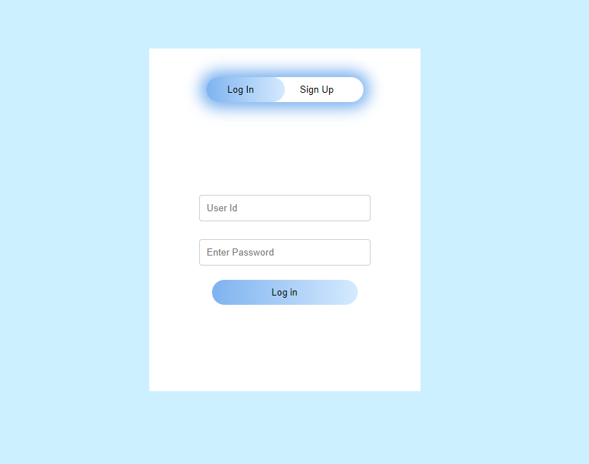
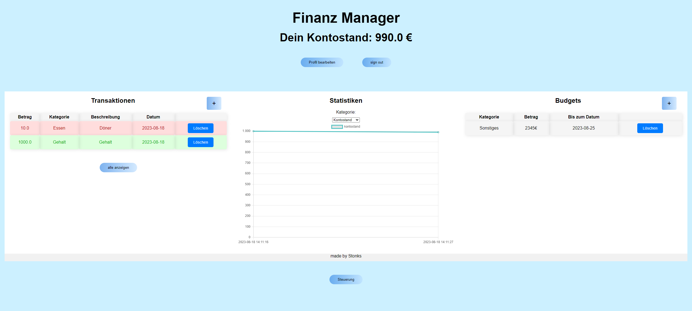
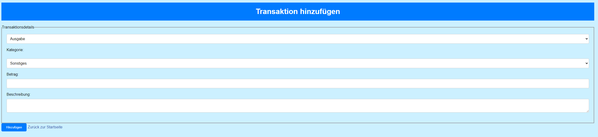
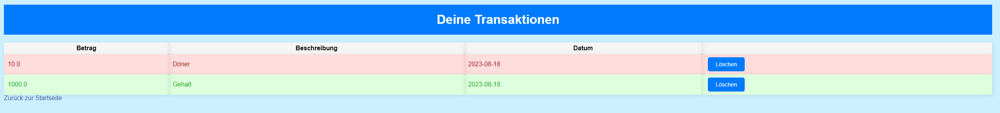
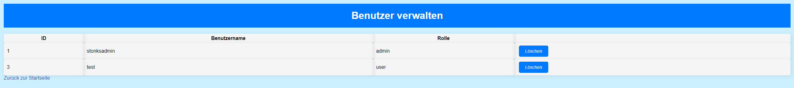
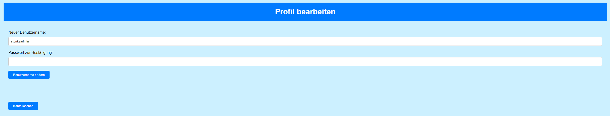
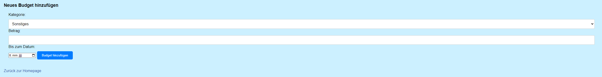

# [API reference]
---

### `login()`

**Route:** `/`

**Methods:** `GET, POST`

**Purpose:** to sign or log in.

**Sample output:**

---

### `logout()`

**Route:** `/logout`

**Methods:** 

**Purpose:** to logout.

**Sample output:**

Browser shows login screen

---

### `homepage()`

**Route:** `/homepage`

**Methods:** `GET`

**Purpose:** to show all accessable funkctions and have an overview of the finances

**Sample output:**

---

### `addTransaction()`

**Route:** `/addTransaction`

**Methods:** `GET, POST`

**Purpose:** insert a Transaction by user input 

**Sample output:**

---

### `transactionOverview()`

**Route:** `/transactionOverview`

**Methods:** `GET`

**Purpose:** show all Transactions from the user

**Sample output:**

---

### `delete_transaction(id)`

**Route:** `delete_transaction/<int:id>`

**Methods:** `,POST`

**Purpose:** delete a selected transaction from the database (and changes Kontostand)

**Sample output:**

Browser shows: `Transaktion erfolgreich gelöscht!`

---

### `Steuerung()`

**Route:** `/Steuerung`

**Methods:** `GET`

**Purpose:** available as admin user, shows all users with delete buttons  

**Sample output:**

---

### `deleteUser()`

**Route:** `//deleteUser/<int:user_id>`

**Methods:** ` POST`

**Purpose:** delete selected User 

**Sample output:**

Browser shows: `Benutzer erfolgreich gelöscht.`

---

### `edit_profile()`

**Route:** `/edit_profile`

**Methods:** `GET, POST`

**Purpose:** lets the user change his username or delete his account, with insertion of his password 

**Sample output:**

---

### `insert/sample()`

**Route:** `/insert/sample`

**Methods:** `GET`

**Purpose:** insert a sample user and sample admin

**Sample output:**

Browser shows: `Database flushed and populated with some sample data.`

---

### `budget()`

**Route:** `/budget`

**Methods:** `GET, POST`

**Purpose:** user can create a budget

**Sample output:**

---

### `delete_budget()`

**Route:** `/delete_budget`

**Methods:** `POST`

**Purpose:** user can delete a budget

**Sample output:**

Deletes the budget

---

### `getChartData()`

**Route:** `/get_chart_data`

**Methods:** `POST`

**Purpose:** getter Function to get the data for drawing the chart

**Sample output:**

returns the data needed
