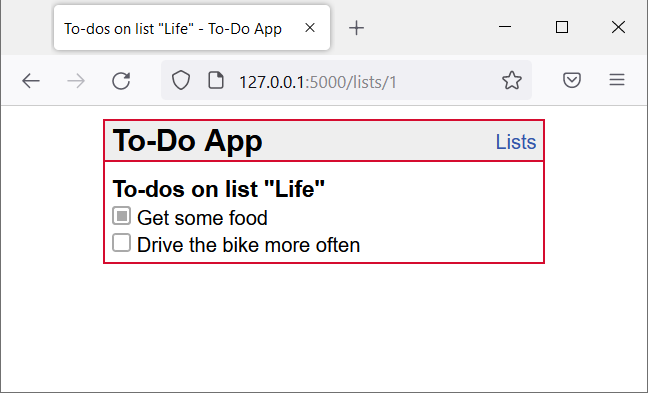

# [API reference]
{: .no_toc }

  

    Table of contents
  

  {: .text-delta }
- TOC
{:toc}

## [Section / module]

### `function_definition()`

**Route:** `/route/`

**Methods:** `POST` `GET` `PATCH` `PUT` `DELETE`

**Purpose:** [Short explanation of what the function does and why]

**Sample output:**

[Show an image, string output, or similar illustration -- or write NONE if function generates no output]

---

## login

### `login()`

**Route:** `/`

**Methods:** `GET, POST`

**Purpose:** to sign in or log in.

**Sample output:**

---

### `homepage()`

**Route:** `/homepage`

**Methods:** `GET`

**Purpose:** .

**Sample output:**

---

## [Example, delete this section] Insert sample data

### `run_insert_sample()`

**Route:** `/insert/sample`

**Methods:** `GET`

**Purpose:** Flush the database and insert sample data set

**Sample output:**

Browser shows: `Database flushed and populated with some sample data.`
