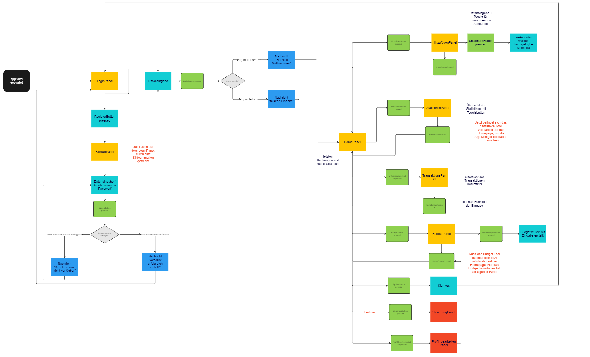

[Frederick Shagalov, Leo Pilgram]
{: .label }

# [App structure, incl. context]
{: .no_toc }

### Das Ablaufdiagramm hat sich nur leicht verändert. Die zuvor überlegte Struktur wurde nahezu genau wie geplant umgesetzt. Alles, was rot markiert ist hat sich geändert seit der Planung. Hinzugekommen sind die Panels "SteuerungPanel" und "Profil_bearbeitenPanel". Dafür wurde das StatistikenPanel und das BudgetPanel auf dem HomePanel integriert.

